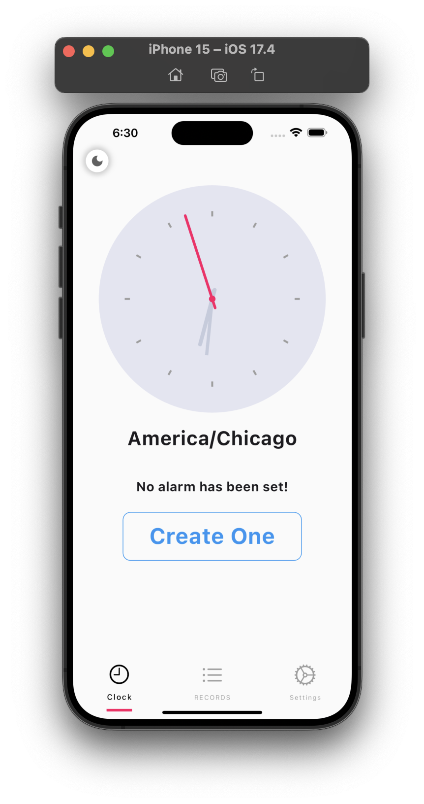

# flutter_clock
This Flutter alarm app utilizes multiple technologies such as flutter_bloc, alarm, go_router, clock, permission_handler, public_ip_address, and Lottie. It is a fully functional app that enables you to set alarms, customize them, and edit them according to your preferences. The app is highly adaptable and provides features such as selecting different alarm sounds, adjusting the volume, and looping the audio. Additionally, the app has an animated dark-light theme that enhances the user experience. 

It's important to mention that the app's UI/UX was designed by me. I invested a lot of effort into making this app and hope You like it.

**Features:**
- Animated theme switcher like the Telegram app

- Set alarm(alarms work even when the app is in background)

- You can see your time, and current time zone like: NewYork/USA

- Set different sounds for your alarm like: Merimba, Nokia, Star Wars, and...

- Add Vibration, loop, and also custom volume level for each alarm

- Swipe to delete alarm

- Edit and delete alarms

- Clean Design(UI/UX)

**Technologies:**
- clock: ^1.1.1
- go_router: ^13.2.4
- public_ip_address: ^1.2.0
- flutter_bloc: ^8.1.5
- equatable: ^2.0.5
- lottie: ^3.1.0
- alarm: ^3.1.0
- bloc: ^8.1.4
- permission_handler: ^11.1.0
- animated_theme_switcher: "^2.0.8"
   

If you like it, please star the project⭐️
It motivates me alot ❤️

 
 
 
 
 
 
 
 
 
 

