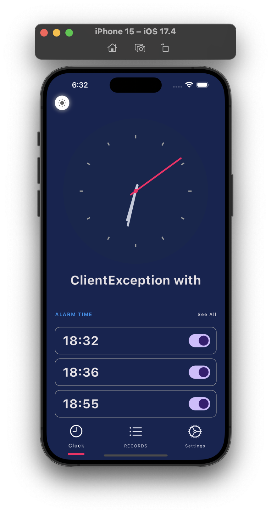
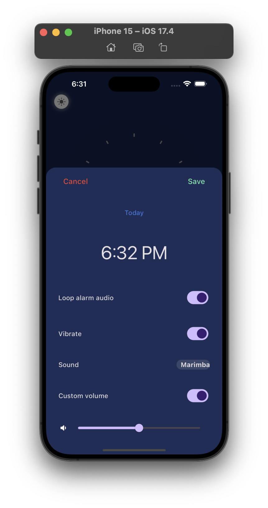

# flutter_clock
This Flutter alarm app utilizes multiple technologies such as flutter_bloc, alarm, go_router, clock, permission_handler, public_ip_address, and lottie. It is a fully functional app that enables you to set alarms, customize them, and edit them according to your preferences. The app is highly adaptable and provides features such as selecting different alarm sounds, adjusting the volume, and looping the audio. Additionally, the app has an animated dark-light theme that enhances the user experience. 

It's important to mention that the app's UI/UX was designed by me.I invested a lot of effort into making this app and hopes that You will find it interesting. If you do, please star it ⭐️

 
 
 
 
 
 
 
 
 
 

